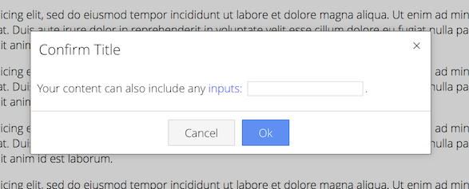

# angular-alert
A simple stand-alone angular alert service

# Features
- Easy to implement
- Uses Callbacks (Angular Promises)
- Works with Forms

# How to use
Add the service from *angular-alert.js* and CSS from *angular-alert.css* to your app.

Use the service in your app
```js
app.controller('ctrl', ['$scope', 'AlertBox', function($scope, AlertBox) {
	
	// Call an AlertBox Service - Alert()
	$scope.alert = function() {
		
		AlertBox.alert({
			title 	: "alert title",
			content : "Your content can include any <span style=\"color:blue;\">styled</span> elements.",
			ok 		: "ok btn"
		}).then(function(AlertScope) {
			console.log("User clicked OK!", AlertScope);
		});
		
	};
	
	// Call AlertBox Service - Confirm()
	$scope.confirm = function() {
		
		AlertBox.confirm({
			title 	: "confirm title",
			content : "Your content can include inputs: <input ng-model=\"testVar\" type=\"text\">.",
			ok 		: "ok btn",
			cancel 	: "cancel btn"
		}).then(function(AlertScope) {
			console.log("User clicked OK!", AlertScope);
		}, function(AlertScope) {
			console.log("User clicked Cancel!", AlertScope);
		});

	};

}]);
```

# Animations
Include the *Animate.css* library (https://daneden.github.io/animate.css) for Alert animations.

# Examples




# License
MIT
