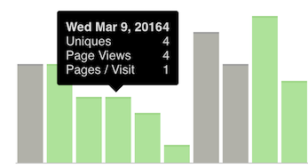

# angular-tooltip
A simple stand-alone angular tooltip directive

# How to use
Add the directive from *angular-tooltip.js* and *angular-tooltip.css* to your angular app.

Use the directive in your app
```html
<a tooltip title="The title of your link">click here</a>
```

```js
Attributes:
		title - element title
```

# Example


# License
MIT
